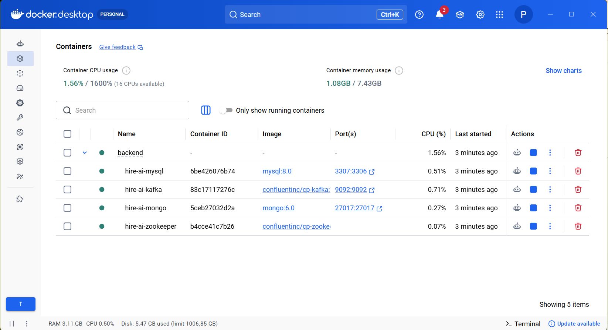
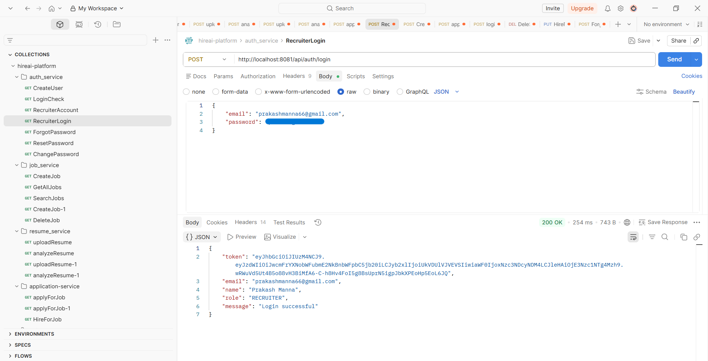
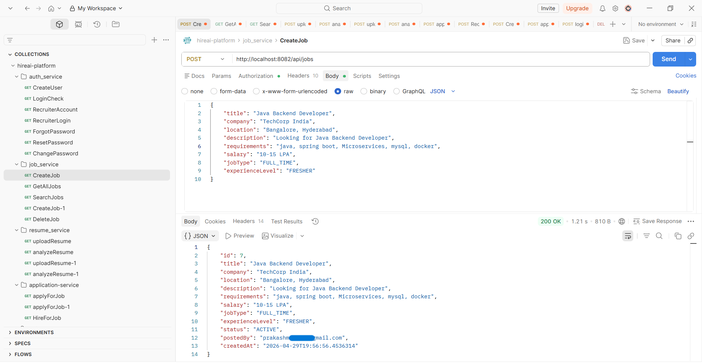
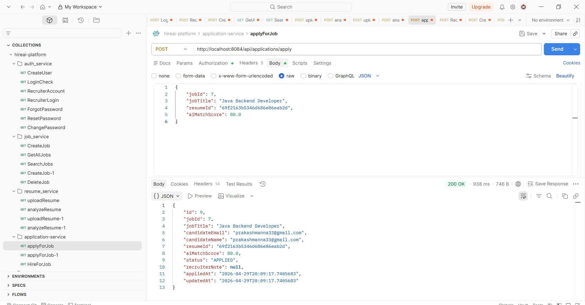
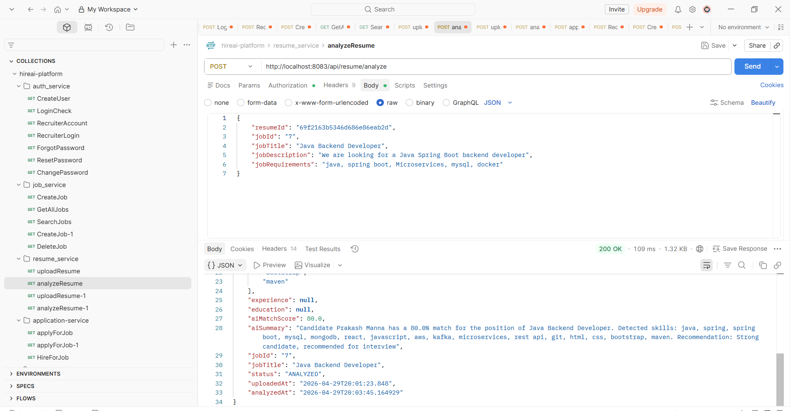
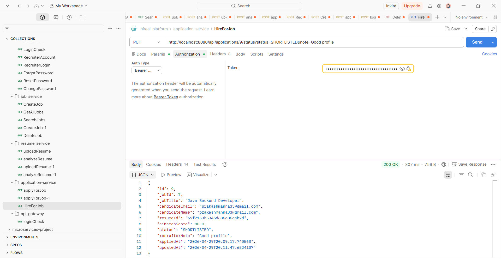
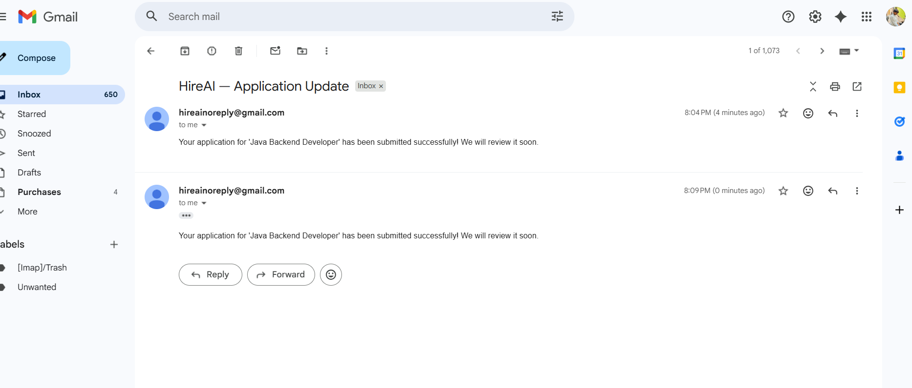
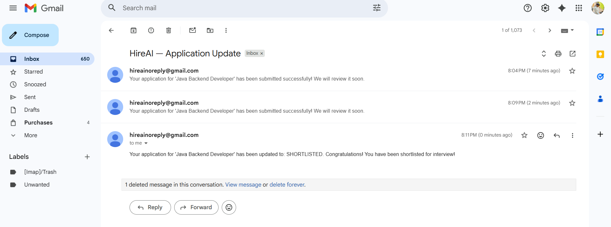

# 🚀 AI Hiring Platform (Backend)

An AI-powered hiring platform backend built using Spring Boot, Docker, Kafka, MySQL, and MongoDB.  
This system automates job posting, candidate application, resume analysis, and email notifications.

---

## 🧠 Features

- 🔐 Recruiter Authentication (Login)
- 📝 Job Creation & Management
- 👨‍💻 Candidate Job Application
- 🤖 AI Resume Analysis
- 📩 Automated Email Notifications
- ⚡ Kafka-based Event Processing
- 🐳 Fully Dockerized Microservices Setup

---

## 🏗️ Tech Stack

- **Backend:** Spring Boot (Java)
- **Database:** MySQL + MongoDB
- **Messaging:** Kafka + Zookeeper
- **Containerization:** Docker & Docker Compose
- **API Testing:** Postman
- **Email Service:** SMTP Integration

---

## ⚙️ System Architecture

> Microservices-based architecture with asynchronous event processing using Kafka.

---

## 🐳 Docker Setup

### Running Containers

---

## 🔐 Recruiter Login

---

## 📝 Create Job

---

## 👨‍💻 Candidate Apply Job

---

## 🤖 AI Resume Analysis

---

## 🧑‍💼 Hire Candidate

---

## 📩 Email Notification (Application)

---

## 📩 Email Notification (Hiring Result)

---

## 🚧 Project Status

- Backend: ~70% Complete
- Core features implemented and tested
- Frontend: In progress
- Active development ongoing

---

## 💡 Future Enhancements

- Frontend UI (React/Next.js)
- AI-based candidate ranking
- Resume parsing improvements
- Real-time dashboard

---

## 👨‍💻 Author

**Prakash Manna**

---

## ⭐ Note

This project is actively being developed and demonstrates real-world backend system design,  
event-driven architecture, and AI integration.
